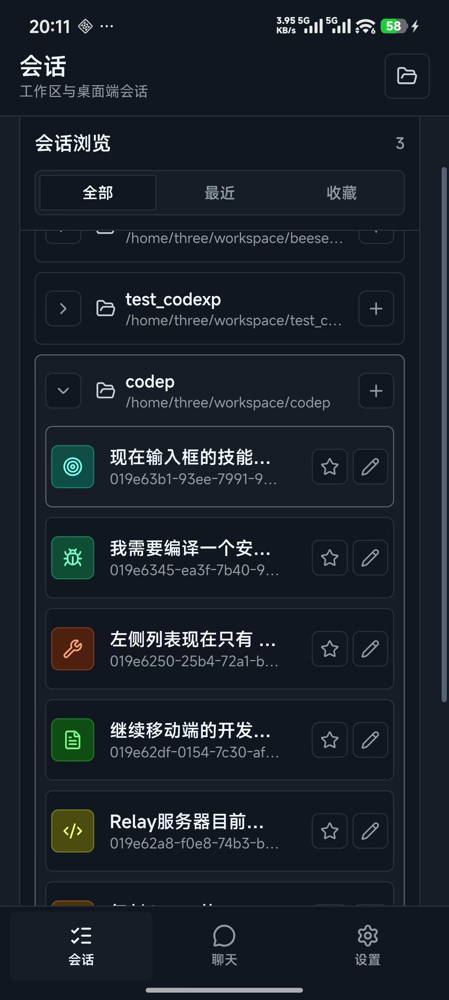
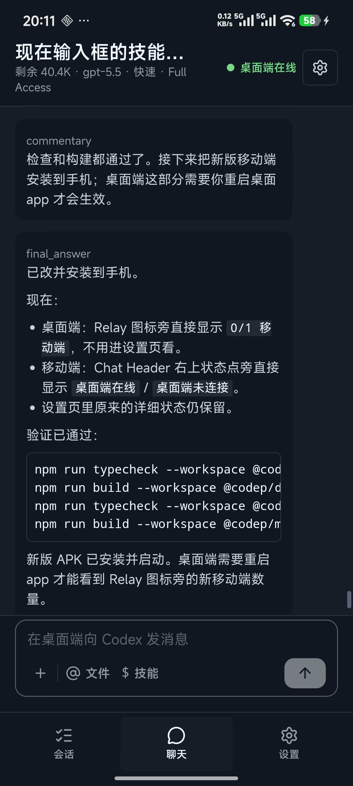

# Codex+

[简体中文](README.zh-CN.md)

Codex+ is a desktop and mobile control surface for working with Codex across real
development workspaces.

The desktop app runs on the workstation, connects to the local `codex app-server`,
shows workspaces and sessions, streams assistant output, exposes command output,
diffs and approvals, and keeps the main coding workflow close to the machine that
owns the files. The mobile app connects through a Relay service so you can inspect
sessions, continue conversations, send prompts, interrupt runs, resolve approvals,
open workspaces, and use file or skill mentions from a phone.

## Screenshots


Codex+ keeps the Codex CLI and workspace access local to the desktop machine.
Mobile clients connect through the Relay server, which handles API key auth,
presence, device discovery, and event replay.


Desktop app with workspace sessions, assistant output, diff details, composer
tools, and Relay/mobile presence in the sidebar.



Mobile session browser grouped by workspace, with recent/favorite filters and
workspace-open controls.



Mobile chat view connected to a desktop session, including desktop presence,
message composer, file mentions, and skill mentions.

## What This Project Does

- Provides a desktop Electron app for local Codex sessions.
- Provides a mobile Capacitor Android app for remote control.
- Bridges desktop and mobile through a Go WebSocket Relay.
- Keeps users isolated by Relay API key.
- Lists desktop devices from an API key so the mobile app does not require manual
  device ID entry.
- Shows connection presence on both sides: Relay state, desktop state, and mobile
  client count.
- Supports mobile commands for sending messages, interrupting turns, resolving
  approvals, opening workspaces, and requesting composer suggestions.
- Supports durable Relay events so mobile clients can reconnect and replay missed
  desktop events from the last acknowledged cursor.
- Includes scripts for local Android installation and Relay production deployment.

## Repository Layout

```text
.
├── apps/
│   ├── desktop/              # React + Vite + Electron desktop app
│   └── mobile/               # React + Vite + Capacitor Android app
├── packages/
│   └── codex-adapter/        # Adapter around `codex app-server`
├── services/
│   └── relay/                # Go WebSocket Relay, admin UI, SQLite event store
├── scripts/
│   ├── deploy-relay-prod.mjs # Production Relay deployment helper
│   └── install-mobile-android.mjs
├── ref/images/               # README screenshots
└── codex-desktop-mobile-plan.md
```

## Architecture

Codex+ is split into five main parts:

- Desktop renderer: React UI for workspaces, sessions, chat, approvals, diffs,
  settings, and Relay presence.
- Electron main/preload: secure desktop boundary for filesystem access, Codex
  process control, workspace picking, and IPC.
- Codex adapter: TypeScript package that connects to `codex app-server`, starts
  or resumes threads, sends turns, interrupts turns, and normalizes events.
- Relay service: Go server that authenticates devices by API key, forwards
  desktop/mobile commands, tracks presence, stores durable events in SQLite, and
  exposes a small admin UI.
- Mobile app: React + Capacitor client for Android. It connects to Relay, selects
  a desktop device from the account, mirrors session state, and sends remote
  commands.

```text
┌──────────────────────────┐
│        Android App        │
│ React + Capacitor         │
│ sessions, chat, approvals │
└─────────────┬────────────┘
              │ wss + API key
              ▼
┌──────────────────────────┐
│          Relay            │
│ Go + WebSocket + SQLite   │
│ auth, presence, replay    │
└─────────────┬────────────┘
              │ wss + API key
              ▼
┌──────────────────────────┐
│       Desktop App         │
│ Electron + React + Vite   │
│ workspace/session UI      │
└─────────────┬────────────┘
              │ local WebSocket
              ▼
┌──────────────────────────┐
│    codex app-server       │
│ local Codex runtime       │
└──────────────────────────┘
```

## Prerequisites

- Node.js 20 or newer.
- npm.
- Go 1.22 or newer for the Relay service.
- Codex CLI with `codex app-server` available on the desktop machine.
- Android Studio or Android SDK for Android builds.
- A connected Android device with USB debugging enabled if you want to install
  the APK from the command line.

## Install

Install JavaScript dependencies from the repository root:

```bash
npm install
```

If the Electron binary download times out, rebuild Electron with a mirror:

```bash
ELECTRON_MIRROR=https://npmmirror.com/mirrors/electron/ npm rebuild electron
```

Validate the full workspace:

```bash
npm run typecheck
npm run build
(cd services/relay && go test ./...)
```

Run Relay tests specifically:

```bash
cd services/relay
go test ./...
```

## Run Locally

Start the Relay server:

```bash
npm run dev:relay
```

Open the Relay admin UI:

```text
http://127.0.0.1:8909/
```

For local development, create a Relay user or invite in the admin UI, then create
an API key. Use the same API key in desktop settings and mobile settings.

Start the desktop Vite dev server:

```bash
npm run dev:desktop
```

Start the Electron app:

```bash
npm run start -w @codep/desktop
```

In Linux containers where Electron's SUID sandbox is not configured, use:

```bash
npm run start:no-sandbox -w @codep/desktop
```

Start the mobile web app for browser testing:

```bash
npm run dev:mobile
```

The mobile dev server listens on `0.0.0.0`, so another device on the same LAN can
open it with the workstation IP address.

## Configure Relay

Desktop and mobile must use the same Relay endpoint and API key.

For local LAN testing:

```text
Relay endpoint: ws://<workstation-lan-ip>:8909
API key:        <key-created-in-relay-admin>
```

For the current production Relay:

```text
Relay endpoint: wss://codex-bridge.three.ink
API key:        <your-user-api-key>
```

The desktop connects as a desktop device. The mobile app uses the API key to list
available desktop devices and lets you select one without manually entering a
device ID.

## Android Build And Install

Build and sync the Android project:

```bash
npm run build -w @codep/mobile
npm run cap:sync -w @codep/mobile
```

Open the project in Android Studio:

```bash
npm run android:open -w @codep/mobile
```

Install a debug APK to a connected phone from the repository root:

```bash
npm run install:mobile:android
```

Install to a specific Android device:

```bash
npm run install:mobile:android -- --target <adb-device-id>
```

The install script builds the mobile app, syncs Capacitor, builds the debug APK,
installs it with `adb`, and launches the app.

If Gradle cannot find the Android SDK, create
`apps/mobile/android/local.properties`:

```properties
sdk.dir=/home/three/Android/Sdk
```

## Desktop Usage

1. Start the desktop app.
2. Add or select a workspace.
3. Pick an existing Codex session or create a new one.
4. Send prompts from the composer.
5. Use the inspector panels to review plans, command output, diffs, approvals,
   and raw events.
6. Configure Relay in settings if you want mobile access.
7. Watch the Relay indicator in the sidebar for Relay state and mobile client
   count.

## Mobile Usage

1. Install or open the mobile app.
2. Set the Relay endpoint and API key in settings.
3. Select one of the listed desktop devices.
4. Browse workspaces and sessions.
5. Open a chat session.
6. Send messages, use file or skill mentions, interrupt running turns, and
   resolve approvals from the phone.
7. Check the chat header for desktop connection state.

## Production Relay Deployment

The included deployment helper targets the configured SSH alias `prod`:

```bash
npm run deploy:relay:prod
```

The script runs Relay tests, builds a Linux amd64 static binary, uploads it to the
server, swaps the systemd binary, restarts `codep-relay`, and verifies local and
public health checks.

Current production details are documented in
`services/relay/README.md`. Do not commit production secrets from the server
environment file.

## Useful Commands

```bash
npm run typecheck
npm run build
npm run probe:adapter -- --turn "Say hello briefly."
npm run dev:relay
npm run dev:desktop
npm run dev:mobile
npm run install:mobile:android
npm run deploy:relay:prod
```

## Status

This repository is an active prototype. The main desktop, mobile, and Relay flows
are functional, including remote mobile control through Relay, reconnect handling,
device discovery, and connection presence. Expect internal package names and
storage keys to still use the original `@codep/*` naming while the repository
name is `codex_plus`.
