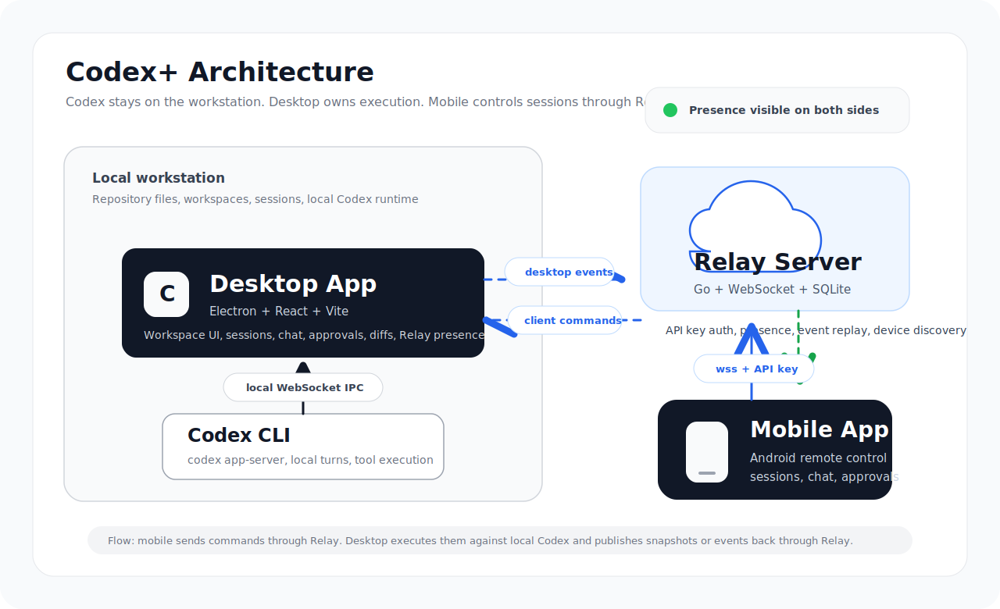
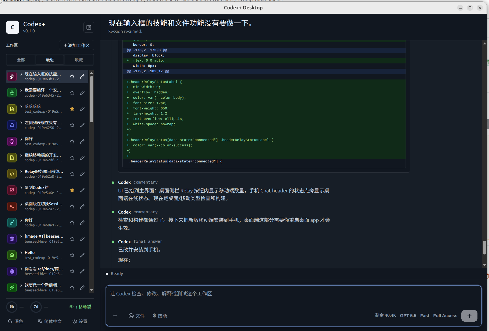
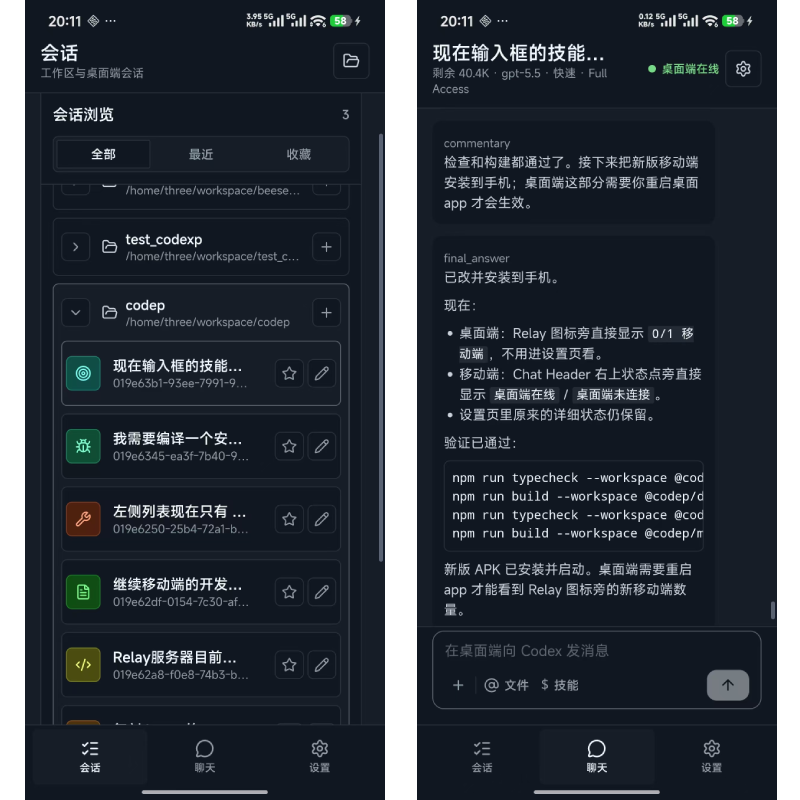

# Codex+

[English](README.md)

Codex+ 是一个面向真实开发工作区的 Codex 桌面端与移动端控制台。

桌面端运行在拥有代码文件的工作站上，连接本机的 `codex app-server`，
负责工作区、会话、聊天输出、命令输出、Diff、审批和本地 Codex 进程控制。
移动端通过 Relay 服务连接桌面端，可以在手机上查看会话、继续对话、发送提示词、
中断任务、处理审批、打开工作区，并在输入框里使用文件和技能提及。

## 界面预览



Codex+ 把 Codex CLI 和工作区文件访问保留在桌面机器本地。移动端通过 Relay
服务器连接桌面端，由 Relay 负责 API key 鉴权、在线状态、设备发现和事件回放。



桌面端展示工作区会话、助手输出、Diff 详情、输入框工具，以及侧边栏中的
Relay 和移动端在线状态。



移动端会话浏览和聊天界面，包含工作区会话、桌面端在线状态、消息输入框、文件提及和技能提及。

## 这个项目做什么

- 提供一个桌面 Electron 应用，用来管理本机 Codex 会话。
- 提供一个移动端 Capacitor Android 应用，用来远程控制桌面端。
- 通过 Go 编写的 WebSocket Relay 连接桌面端和移动端。
- 使用 Relay API key 隔离不同用户。
- 移动端可通过 API key 自动列出桌面设备，不需要手动填写设备 ID。
- 桌面端和移动端都能清楚看到连接状态：Relay 状态、桌面端状态、移动端数量。
- 移动端支持发送消息、中断任务、处理审批、打开工作区、请求输入框文件和技能建议。
- Relay 支持持久事件，移动端断线重连后可以从上次确认的位置继续回放事件。
- 包含本机安装 Android APK 和生产环境部署 Relay 的脚本。

## 仓库结构

```text
.
├── apps/
│   ├── desktop/              # React + Vite + Electron 桌面端
│   └── mobile/               # React + Vite + Capacitor Android 移动端
├── packages/
│   └── codex-adapter/        # 对 `codex app-server` 的适配层
├── services/
│   └── relay/                # Go WebSocket Relay、管理后台、SQLite 事件库
├── scripts/
│   ├── deploy-relay.mjs      # Relay 部署脚本
│   └── install-mobile-android.mjs
├── ref/images/               # README 使用的截图
└── codex-desktop-mobile-plan.md
```

## 架构

Codex+ 由五个核心部分组成：

- 桌面端渲染层：React UI，负责工作区、会话、聊天、审批、Diff、设置和连接状态。
- Electron main/preload：桌面安全边界，负责文件系统访问、Codex 进程控制、工作区选择和 IPC。
- Codex adapter：TypeScript 包，连接 `codex app-server`，负责启动或恢复 thread、发送 turn、
  中断 turn，并把事件规范化。
- Relay 服务：Go 服务，负责 API key 鉴权、桌面与移动端消息转发、在线状态、SQLite 持久事件和管理后台。
- 移动端应用：React + Capacitor Android 客户端，连接 Relay、选择桌面设备、同步会话状态并发送远程命令。

```text
┌──────────────────────────┐
│       Android App         │
│ React + Capacitor         │
│ 会话、聊天、审批           │
└─────────────┬────────────┘
              │ wss + API key
              ▼
┌──────────────────────────┐
│          Relay            │
│ Go + WebSocket + SQLite   │
│ 鉴权、在线状态、事件回放   │
└─────────────┬────────────┘
              │ wss + API key
              ▼
┌──────────────────────────┐
│       Desktop App         │
│ Electron + React + Vite   │
│ 工作区和会话界面           │
└─────────────┬────────────┘
              │ 本地 WebSocket
              ▼
┌──────────────────────────┐
│    codex app-server       │
│ 本机 Codex 运行时          │
└──────────────────────────┘
```

## 环境要求

- Node.js 20 或更新版本。
- npm。
- Go 1.22 或更新版本，用于 Relay 服务。
- 桌面机器上需要安装 Codex CLI，并能运行 `codex app-server`。
- Android Studio 或 Android SDK，用于 Android 构建。
- 如果要通过命令行安装 APK，需要一台已开启 USB 调试的 Android 手机。

## 安装

在仓库根目录安装依赖：

```bash
npm install
```

如果 Electron 下载超时，可以使用镜像重建：

```bash
ELECTRON_MIRROR=https://npmmirror.com/mirrors/electron/ npm rebuild electron
```

验证整个工作区：

```bash
npm run typecheck
npm run build
(cd services/relay && go test ./...)
```

单独运行 Relay 测试：

```bash
cd services/relay
go test ./...
```

## 本地运行

启动 Relay：

```bash
npm run dev:relay
```

打开 Relay 管理后台：

```text
http://127.0.0.1:8909/
```

本地开发时，在管理后台创建用户或邀请码，然后创建 API key。桌面端和移动端需要配置同一个 API key。

启动桌面端 Vite dev server：

```bash
npm run dev:desktop
```

启动 Electron 桌面端：

```bash
npm run start -w @codep/desktop
```

如果在 Linux 容器里 Electron SUID sandbox 未配置，可以使用：

```bash
npm run start:no-sandbox -w @codep/desktop
```

### 桌面端版本检测

桌面端启动后会请求版本 manifest，发现远端版本高于当前 `app.getVersion()` 时，在侧边栏提示用户下载。默认地址是：

```text
https://codex-bridge.three.ink/codex-plus/desktop/latest.json
```

可以用环境变量覆盖或关闭：

```bash
CODEX_PLUS_UPDATE_MANIFEST_URL=https://example.com/codex-plus/latest.json npm run start -w @codep/desktop
CODEX_PLUS_DISABLE_UPDATE_CHECK=1 npm run start -w @codep/desktop
```

Manifest 示例：

```json
{
  "version": "0.1.17",
  "releaseNotes": "Bug fixes and packaging updates.",
  "downloads": {
    "macos-arm64": { "url": "https://example.com/codex-plus_0.1.17_macos_arm64.dmg" },
    "macos-x64": { "url": "https://example.com/codex-plus_0.1.17_macos_x64.dmg" },
    "windows-x64": { "url": "https://example.com/codex-plus_0.1.17_windows_x64.zip" },
    "deb-amd64": { "url": "https://example.com/codex-plus_0.1.17_amd64.deb" }
  }
}
```

启动移动端 Web 开发服务：

```bash
npm run dev:mobile
```

移动端 dev server 监听 `0.0.0.0`，同一局域网内的手机可以通过工作站 IP 访问。

## 配置 Relay

桌面端和移动端必须使用同一个 Relay endpoint 和 API key。

本地局域网测试：

```text
Relay endpoint: ws://<工作站局域网 IP>:8909
API key:        <Relay 管理后台创建的 key>
```

已部署的 Relay：

```text
Relay endpoint: wss://<你的 Relay 域名>
API key:        <你的用户 API key>
```

桌面端会以 desktop device 身份连接。移动端会通过 API key 获取可用桌面设备列表，
然后选择目标桌面端，不需要手动填写设备 ID。

## Android 构建与安装

构建并同步 Android 项目：

```bash
npm run build -w @codep/mobile
npm run cap:sync -w @codep/mobile
```

在 Android Studio 中打开项目：

```bash
npm run android:open -w @codep/mobile
```

从仓库根目录安装 debug APK 到已连接手机：

```bash
npm run install:mobile:android
```

安装到指定 Android 设备：

```bash
npm run install:mobile:android -- --target <adb-device-id>
```

安装脚本会构建移动端、同步 Capacitor、构建 debug APK、通过 `adb` 安装，并启动应用。

如果 Gradle 找不到 Android SDK，创建 `apps/mobile/android/local.properties`：

```properties
sdk.dir=/home/three/Android/Sdk
```

## 桌面端使用

1. 启动桌面端应用。
2. 添加或选择工作区。
3. 选择已有 Codex 会话，或创建新会话。
4. 在输入框发送提示词。
5. 在检查面板查看计划、命令输出、Diff、审批和原始事件。
6. 如果需要手机访问，在设置里配置 Relay。
7. 通过侧边栏 Relay 指示器查看 Relay 状态和移动端连接数量。

## 移动端使用

1. 安装或打开移动端应用。
2. 在设置中填写 Relay endpoint 和 API key。
3. 从列表中选择桌面设备。
4. 浏览工作区和会话。
5. 打开聊天会话。
6. 在手机上发送消息、使用文件或技能提及、中断运行中的任务、处理审批。
7. 通过聊天 Header 查看桌面端是否在线。

## Relay 部署

仓库内置的是通用部署脚本。通过环境变量传入你自己的 SSH 目标和公网健康检查地址：

```bash
CODEP_RELAY_DEPLOY_TARGET=<ssh-host-or-alias> \
CODEP_RELAY_DEPLOY_PUBLIC_HEALTH_URL=https://<你的 Relay 域名>/healthz \
npm run deploy:relay
```

脚本会运行 Relay 测试，构建 Linux amd64 静态二进制文件，上传到服务器，替换 systemd
服务使用的二进制文件，重启 `codep-relay`，并验证本地和公网健康检查。

部署路径、服务名和健康检查地址都可以通过环境变量覆盖。完整变量列表见
`services/relay/README.md`。不要提交服务器环境文件里的生产密钥。

## 常用命令

```bash
npm run typecheck
npm run build
npm run probe:adapter -- --turn "Say hello briefly."
npm run dev:relay
npm run dev:desktop
npm run dev:mobile
npm run install:mobile:android
npm run deploy:relay
```

## 当前状态

这是一个持续开发中的原型。桌面端、移动端和 Relay 的主流程已经可用，包括通过 Relay
进行移动端远程控制、断线重连、设备发现和连接状态展示。仓库已经重命名为 `codex_plus`，
但内部 workspace 包名和本地存储 key 仍保留原来的 `@codep/*` 命名。
